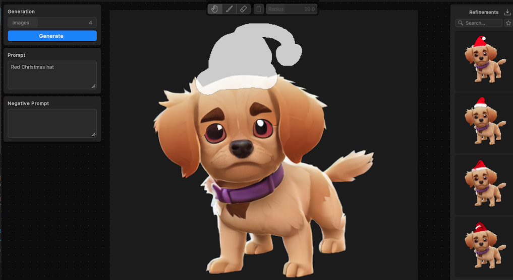

# Refine with masking

Masking provides enhanced control over the output. Use a mask to refine any part of a generated sprite. You can adjust the mask with brush settings and an eraser.

1. Hover your cursor over the sprite that you want to refine. The **Refine** icon appears.
1. Select the **Refine** icon to enter the Refine mode.
1. To activate the masking brush, select **Inpaint**.
1. To adjust the size of the brush, move the **Radius** slider.
1. Paint a mask over the area that you want to refine.
1. To erase the mask, select **Eraser**. The eraser uses the same radius as the brush.
1. Enter a prompt that describes the desired refinement.
1. Select **Generate**. This regenerates subjects in the masked area.

   

> [!TIP]
> You can also double-click a generated sprite in the **Generations** panel to enter the Refine mode.

## Additional resources

* [Write a prompt](xref:write-prompt)
* [Generate sprites](xref:generate)
* [Tool reference](xref:tool-reference)