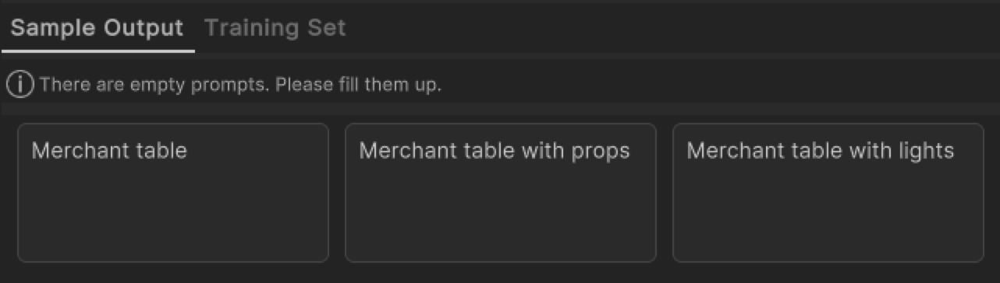
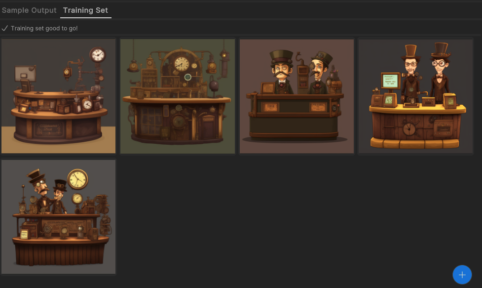

# Style trainer

When you generate sprites, you can use a style to influence the look of the generated sprites. The Muse Sprite tool provides several default styles to generate sprites based on them. You can also train your own styles.

You can use the Style Trainer to train your own styles by setting the sample output prompts, training images, and training steps:

- Sample output prompts serve as a validation to show what is the result of the prompt. At least three and no more than five prompts are required.
- Training images are reference images to indicate the style that you want. To train a style, at least five and no more than 15 reference images are required.
- Training steps indicate how many iterations the trainer runs through the training set images to capture the intended style of the image. The higher the number of iterations, the longer the training takes.

## Create a style

1. In Unity, from the menu, select **Muse** > **Style Trainer**.
1. Select the **Add (+)** button on the bottom left to create a new style.
1. Enter a name and description for your style.

## Train a style

1. In the **Style** panel, select the style you want to train.
1. Move the **Training Steps** slider to set the number of iterations.

    > [!NOTE]
    > A higher number of iterations doesn't give better results.
1. Select the **Sample Output** tab.
1. Select the **Add (+)** button to create a new sample output.
1. Enter a sample output prompt. This is the text that will be used to generate the sample output.

    > [!NOTE]
    > You can't enter duplicated prompts for sample output.

    
1. Select the **Training Set** tab.
1. Select the **Add (+)** button to add a reference image. You can also drag and drop images.

    > [!NOTE]
    > <ul><li>You can't add duplicated images. </li><li> Image size must be between `128 x 128` and `512 x 512` pixels. Images that are smaller or larger than the value are resized automatically.</li><li> Use of an alpha channel in an image isn't supported. Any alpha channel information are automatically removed.</li></ul>

    
1. Select **Generate Style** to start training. After training, it generates a Style Version and creates images from Sample Output prompts. You can validate if the Style Version is good for style generation.

    

## Create a new version

If you aren't happy with the training results, you can create a new version by selecting **New Version**. You can then change the training set to influence the style.

> [!NOTE]
> You can't change the sample output prompts or the reference images once a style version is trained.

## Use a style in Muse Sprite Generator

To use a style, when you generate sprites in Muse Sprite Generator, select the style from the **Style** list.

## Use a specific version of a style

If a style has multiple versions, it uses the latest version by default. To use a specific version of the style, star the version in the **Style Trainer** window.

## Duplicate a style

If you want to start a new style with the current training images and sample output prompts, select **Duplicate Style** in the **Style Trainer** window.

## Hide a style

To hide a style from showing in the Muse Sprite Generator's **Style** list, select the **Hide** icon in the **Style Trainer** window.

## Delete a style

To delete a style, hover over the style and select the **Delete** icon in the **Style Trainer** window. This deletes the style from the server.

> [!NOTE]
> You can only delete styles that aren't trained.

## Additional resources

* [Generate sprites](xref:generate)
* [Refine with masking](xref:refine)